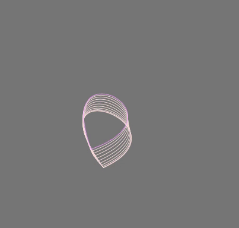

# Generative Art

## What is Generative Art?

Generative Art refers to any art practice where the artist uses a system, such as a set of natural language rules a computer program, 
a machine, or other procedural invention, which is then set into motion with some degree of autonomy to or resulting in a complex 
work of art. Please read[ Philip Galanter's research paper ](https://www.philipgalanter.com/downloads/ga2003_paper.pdf) for more details on Generative Art & Creative coding.

### Tools I used for creating Generative Art:
Processing, Rstudio, HTML, Javascript, p5.js, Three.js

### Examples of Generative Art created by me

#### Music Visualizer

#### Generative Flowers

#### Trippy

#### R_Studio

### RStudio code is inpsired by [Katharine Brunner](https://katharinabrunner.de/software-portfolio/)
