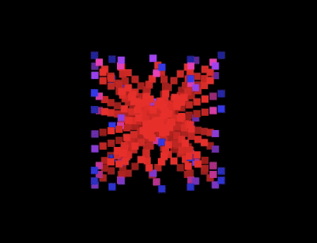

# Generative Art

### Check out my personal website for more interactive art : https://ishasharmax.github.io/

## What is Generative Art?

Generative Art refers to any art practice where the artist uses a system, such as a set of natural language rules a computer program, 
a machine, or other procedural invention, which is then set into motion with some degree of autonomy to or resulting in a complex 
work of art. Please read[ Philip Galanter's research paper ](https://www.philipgalanter.com/downloads/ga2003_paper.pdf) for more details on Generative Art & Creative coding.

### Examples of Generative Art created by me
#### Color flash

#### Point Art 

#### Kadinsky - Circles in Circle

#### Kadinsky - Color study

#### Mondrian - Composition with Red Blue and Yellow

#### 10 Print

#### Sinusoidal wave (point art)

#### Music Visualizer

#### Generative Flowers

#### Trippy

#### R_Studio

#### Fronkonstin Technique

## Built With
* [Processing](https://processing.org/) 
* [Rstudio](https://docs.rstudio.com/) 
* [HTML](https://en.wikipedia.org/wiki/HTML) 
* [Javascript](https://www.javascript.com/) 
* [Three.js](https://threejs.org/)
* [p5.js](https://p5js.org/)
* [Python](https://www.python.org/)

## Contribution

### RStudio code is inpsired by [Katharine Brunner](https://katharinabrunner.de/software-portfolio/) and [Fronkonstin](https://fronkonstin.com)
### [Jason Bailey's](https://lnkd.in/eZNeGVZ) article 

## Authors

* **Isha Sharma** - [Ishasharmax](https://github.com/ishasharmax)
